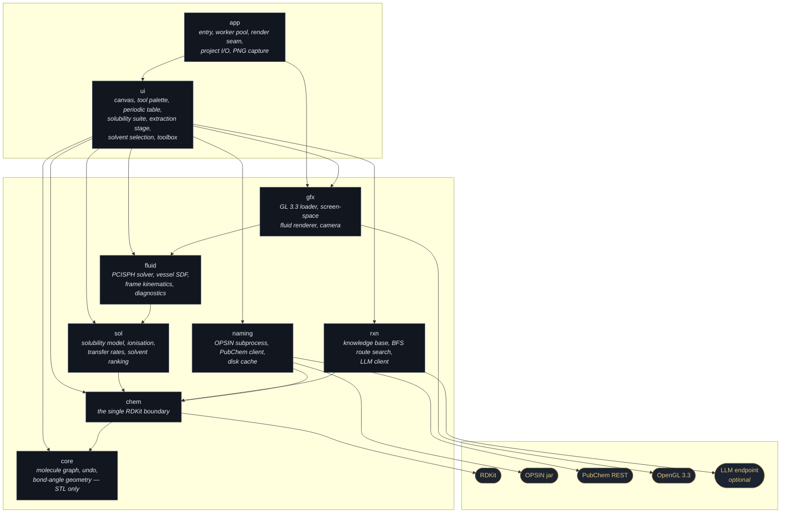
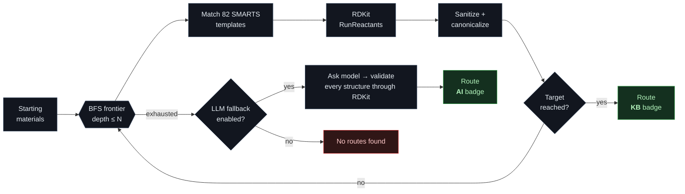
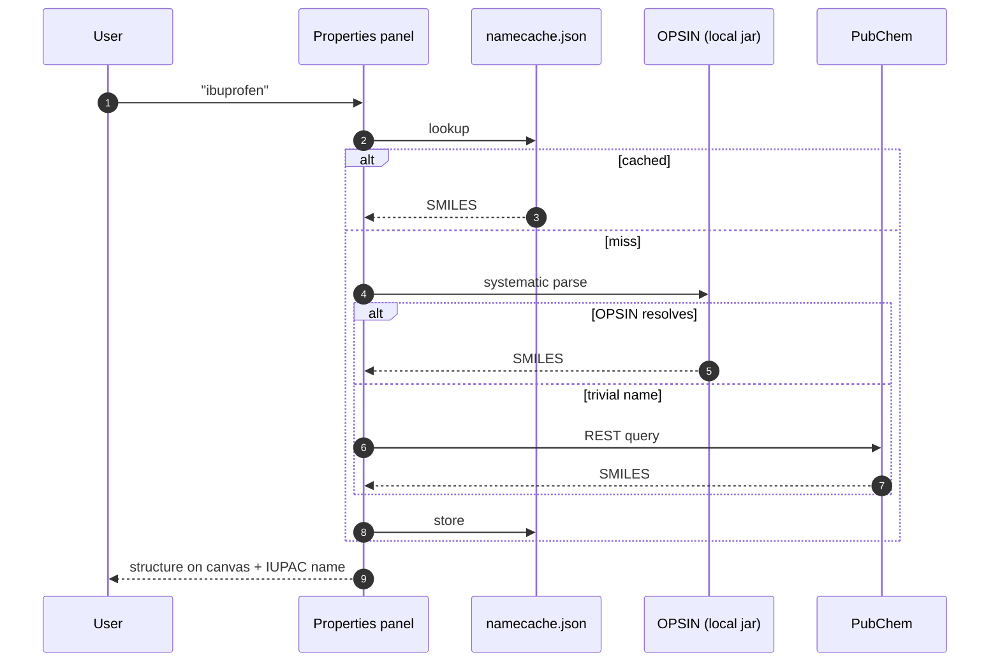

<div align="center">

# ChemCAD

**A ChemDraw-style structure sketcher, name/structure translator and retrosynthesis planner — in a single native C++20 binary.**

[](CMakeLists.txt)
[](https://github.com/ocornut/imgui)
[](https://www.rdkit.org/)
[](tests)
[](LICENSE)


</div>

---

## What it is

Draw a molecule with automatic bond angles, get its formula, weight, cLogP and
IUPAC name live in the side panel — then hand the planner a starting material
and a target and let it search 154 curated reaction templates for a route,
complete with reagents, conditions and predicted side products. Or describe a
purification and let it rank the solvents that will actually do it. Or charge a
separatory funnel and shake it, and watch a real multiphase fluid simulation
decide how the layers break.

Roughly 29,500 lines of C++20 across nine libraries, 5,900 lines of tests, and
no framework: the UI layer is plain Dear ImGui, so it can be hosted inside
another ImGui application unchanged.

| | |
| --- | --- |
| **Sketching** | Angle-snapped bonds, ring templates, wedge/hash stereo, charges, drag-erase with a destructive preview, undo/redo, CoordGen clean-up |
| **Chemistry** | RDKit behind one boundary header — canonical SMILES, descriptors, substructure, reaction application |
| **Naming** | `name → structure` via local OPSIN, PubChem fallback for trivial names; `structure → name` via PubChem; both cached on disk |
| **Planning** | Breadth-first search over 154 SMARTS templates, ranked routes, per-step reagents/conditions/by-products/mechanism notes, optional LLM fallback lane |
| **Solubility** | Flory-Huggins/extended-Hansen activity, Yalkowsky GSE for the aqueous share, Kirkwood-Buff decomposition, group-contribution pKa with Henderson-Hasselbalch and a Born dielectric penalty, literature anchors that override exactly |
| **Solvent selection** | Rank solvents for extraction, recrystallisation, trituration, anti-solvent precipitation, chromatography or a reaction medium, gated on whether the separation actually works, with CHEM21 greenness |
| **Fluid** | 3D multiphase PCISPH in the vessel frame: shake it vertically, tilt it, invert it, and read the measured interfacial area, Sauter diameter and dispersed fraction back out |
| **I/O** | Project files, MOL/SMILES export, PNG framebuffer capture of the canvas |

---

## Architecture

Nine static libraries with a strictly one-way dependency graph. `core` is pure
STL — the molecule graph, undo stack and bond-angle geometry have no idea RDKit
exists — and every RDKit call in the program funnels through `chem/bridge.hpp`.
`fluid` is pure computation with no graphics, and every OpenGL call outside Dear
ImGui's own backend lives in `gfx`, which is why the panel tests can drive the
real panels with no GL context at all.



Long-running work never touches the render thread. Naming lookups and route
searches go through `app::TaskRunner`'s worker pool and are pumped back into
`AppState` once per frame; the fluid solver owns its own worker and publishes an
immutable snapshot, so the UI reads a completed state and never waits on a
half-finished solve.

The 3D fluid reaches the screen through one seam: the extraction panel publishes
a render request into `AppState::fluidStage` and draws the previous frame's
texture with `ImGui::Image`, then `main.cpp` renders that request into a
framebuffer object after ImGui has recorded its draw data. One frame of latency,
invisible at 60 Hz, and no GL call anywhere in the UI layer.

---

## Route search

`Suggest Routes` runs a breadth-first search from the starting materials,
applying every template whose SMARTS matches, until it reaches the target or
exhausts the depth budget. Each hop records the reagents, conditions,
by-products the atom mapping cannot express, and a mechanism note.




*`CCCCBr → CCCC(=O)O` in two steps: SN2 hydrolysis (NaOH, aqueous reflux,
bromide by-product) followed by Jones oxidation (CrO₃/H₂SO₄).*

---

## Naming

Two independent directions, both cached in `~/.cache/chemcad/namecache.json`.
Without a network the sketcher is unaffected; naming simply reports it is
offline.




---

## Solubility suite

Predicts solubility, in g/mL, of the sketched (or SMILES-entered) compound
in a pure solvent or a blend of up to three solvents, at a chosen
temperature.

```mermaid
flowchart LR
    struct["Sketch or<br/>SMILES"] --> desc["McGowan volume,<br/>Crippen logP,<br/>Joback melting point"]
    desc --> hansen["van Krevelen /<br/>Hoftyzer group<br/>contributions"]
    hansen --> blend{{"Blend up to 3<br/>solvents by<br/>volume fraction"}}
    blend --> chi["Extended-Hansen chi<br/>dispersion / polar /<br/>H-bond terms"]
    chi --> fh["Flory-Huggins<br/>solute activity"]
    fh --> gse["Blend with Yalkowsky<br/>GSE by water fraction"]
    gse --> ion["Ionisation:<br/>pKa, Henderson-Hasselbalch,<br/>Born penalty"]
    ion --> anchor{{"Literature anchor?"}}
    anchor -->|yes| meas["Measured value"]
    anchor -->|no| gml["Predicted g/mL<br/>+ uncertainty"]

    classDef n fill:#12161f,stroke:#3b4c63,color:#e6edf3
    classDef ok fill:#14301f,stroke:#2f9e44,color:#b2f2bb
    class struct,desc,hansen,blend,chi,fh,gse,ion,anchor n
    class gml,meas ok
```



The solute side: molar volume from McGowan atomic contributions, and Hansen
solubility parameters (`deltaD`, `deltaP`, `deltaH`) from van
Krevelen/Hoftyzer group contributions on the sketched structure. A blend's
Hansen parameters and density are volume-fraction weighted means of its
components. Hansen distance `Ra = sqrt(4*dD^2 + dP^2 + dH^2)` and `RED = Ra
/ R0` (R0 is the solute's Hansen sphere radius) measure how well solute and
solvent match. Ideal mole-fraction solubility comes from the melting point
via the Yalkowsky equation with an entropy of fusion fixed at 56.5 J/(mol K).

The activity is then a **Flory-Huggins** solve for the solute volume fraction,

```
ln a_s = ln(phi_s) + (1 - r)(1 - phi_s) + chi (1 - phi_s)^2,   r = V_solute / V_mixture
```

with `chi` from a fitted extended-Hansen expression (dispersion, polar and
directional H-bond terms). The combinatorial coefficient is `(1 - r)`, not
`(1 - 1/r)`: the latter is the SOLVENT's activity in the same theory, and using
it for the solute inverts the size-asymmetry entropy — a factor of 16 for a
230 cm3/mol solute in acetone, and the reason an earlier version of this model
bottomed out in whichever solvent matched the solute best. Because a large `chi`
folds the curve (real liquid-liquid demixing), the saturation root is found by
scanning for the LOWEST crossing rather than assuming monotonicity.

For the aqueous share of a blend the result is blended log-linearly with the
**Yalkowsky general solubility equation**, `log S = 0.5 - 0.01(Tm - 25) - logP`,
gated to crystalline solutes because its melting term IS the lattice penalty.
That single addition moved the aqueous column of the validation set from a
median error of 1.18 log to 0.38 log.

**Ionisable solutes and salts** then get the physics a neutral model cannot see.
A group-contribution pKa (with a Hammett-scale correction for electron-poor ring
nitrogens, so a xanthine is not mistaken for an imidazole base) feeds
Henderson-Hasselbalch against either a supplied pH or the pH the saturated
solution sets itself. Which SOLID is in the flask decides the branches: a free
base dissolves as the neutral species plus its ions, while a hydrochloride
crystal only dissolves by putting ions into solution — so the salt path drops the
neutral term and takes a **Born** electrostatic penalty for carrying an ion pair
into a low-dielectric solvent, plus an ion-pair branch for the regime below
eps ~ 15 where Bjerrum association is complete. Drawn as its hydrochloride, a
tropane alkaloid goes from 10 mg/mL to 1.3 g/mL in water (measured ~0.9 g/mL of
solution) while staying about a decade under its free base in chloroform and
effectively insoluble in hexane.

A **Kirkwood-Buff** decomposition reports G11 and G12 by Ben-Naim inversion of
the calibrated activity, with the isothermal compressibility sourced per solvent
(water's G11 comes out at -17.0 cm3/mol, matching the literature).

Literature anchors override the model exactly where measured data exists, and
everything else carries its measured envelope: on the 14-pair validation set the
median error is 0.64 log, 86% of pairs land inside an order of magnitude and all
of them inside a factor of 30. Melting point defaults to a Joback estimate and
says so; a result with `RED > 1` is flagged as extrapolated outside the Hansen
sphere.

`data/solvents.json` carries 45 common laboratory solvents, each with Hansen
parameters, density, molar volume, dielectric constant, isothermal
compressibility, boiling and melting points, flash point, refractive index,
water miscibility, cost tier, peroxide-former flag, a hazard note, and its
CHEM21 safety/health/environment scores and class (Prat et al., *Green Chem.*
2016, **18**, 288). 43 of the 45 are fully CHEM21-rated; the two the guide does
not cover say so in their provenance field rather than carrying an invented
score:

```json
{
  "id": "water",
  "name": "Water",
  "smiles": "O",
  "family": "water",
  "molar_mass": 18.02,
  "density": 0.997,
  "molar_volume": 18.1,
  "delta_d": 15.5,
  "delta_p": 16.0,
  "delta_h": 42.3,
  "dielectric": 80.1,
  "boiling_point": 100.0,
  "refractive_index": 1.333,
  "water_miscible": true
}
```

Add another solvent by dropping a matching object into the array.

The ratio graph plots the prediction as the blend composition changes: a line of
g/mL against the volume fraction of solvent A for a two-solvent blend, or, for a
three-solvent system, a continuous colour-mapped surface over the whole
composition range drawn inside an axonometric cube — Lambert-shaded, isolined,
painter-ordered, with a value legend, the current composition marked and the
global optimum called out.

### Separatory funnel

A real 3D multiphase fluid simulation of a separatory funnel, decanting flask or
graduated cylinder, for working through a liquid-liquid separation before doing
it on the bench. Not an animation: a solver.

Each phase is charged with a volume, density, viscosity, interfacial tension and
colour, and the vessel is filled with a particle lattice, densest phase at the
bottom. From there the physics is:

- **PCISPH** pressure projection (Solenthaler & Pajarola, ACM TOG 28(3), 2009).
  A weakly-compressible Tait equation of state would tie the timestep to an
  artificial speed of sound; the prediction-correction loop reaches the same
  incompressibility at a timestep three orders of magnitude larger.
- **Density-contrast SPH** for the multiphase part (Solenthaler & Pajarola, SCA
  2008). Densities are computed as a number density and converted per particle
  with its own mass, because standard mass-density SPH smooths the jump at a
  water/dichloromethane boundary into a gap. The pressure force uses their
  corrected symmetric form, which stays exactly antisymmetric per pair even with
  unequal masses — measured internal-momentum residual 1.2e-10 kg m/s over 100
  steps.
- **Interfacial tension** from colour-field curvature plus an Akinci et al.
  (2013) cohesion term. Its coefficient is resolution dependent, so it is
  calibrated against the Young-Laplace law at the working spacing rather than
  being set equal to a measured N/m, which would be dimensionally wrong.
- **An analytic signed-distance boundary** revolved from the same vessel profile
  the 2D schematic draws, including the kernel-integrated glass density that
  stops a wall particle from behaving as if it were at a free surface.
- **The vessel frame.** The solver integrates in vessel coordinates and adds the
  full set of fictitious accelerations, driven by the analytic shake law rather
  than by differencing pointer positions. That is what makes a VERTICAL shake
  real physics: it is simply another component of the translational forcing.

Shake it along any axis, grab it with the mouse, tilt it, invert it to vent.
What comes back out is measured, not correlated: bulk versus dispersed volume by
connected components, the Sauter mean droplet diameter, and the total
liquid-liquid interfacial area from |grad c| quadrature (validated at 0.95 of a
flat analytic area and 0.97 of a sphere's). That measured area drives the
two-film mass-transfer rate, so shaking harder and longer really does transfer
more solute, and the rate converges to exactly the partition equilibrium the
rest of the app reports.

The stage renders with screen-space fluid rendering (van der Laan, Green & Sainz,
I3D 2009): sphere-impostor depth, perspective-correct curvature-flow smoothing,
per-phase optical thickness for Beer-Lambert absorption, and a revolved glass
shell. A 2D schematic mode projects the same particles onto a cut plane.

Volume is conserved, the solve is deterministic — bit-identical across worker
counts and between the synchronous and asynchronous paths — and the panel
reports its own honesty: particle count, substeps, pressure iterations, worst
compression, the free-surface deficit an SPH surface legitimately shows, and the
achieved real-time factor.

---

## Solvent selection

Describe the operation you actually want to run and get a ranked list of
solvents that will do it, with the reasoning shown rather than a score out of
ten. Six operations are modelled, each with its own figure of merit:

| Operation | What it optimises |
| --- | --- |
| Liquid-liquid extraction | Distribution ratio of the target against every contaminant, recovery per contact, washes needed for 99% |
| Recrystallisation | Hot/cold solubility contrast for the target, contaminants staying in the mother liquor, solvent liquid across both temperatures |
| Trituration | The inverse: target nearly insoluble, contaminants freely soluble, and the target loss that costs |
| Anti-solvent precipitation | The best solvent/anti-solvent PAIR and fraction, by achievable supersaturation and contaminant carry-over |
| Chromatography mobile phase | Polarity window placing target and contaminants on opposite sides — labelled a heuristic, not a retention-factor prediction |
| Reaction medium | Dissolves everything, protic vs aprotic flagged, boiling point inside the requested window |

Any number of species can be tagged KEEP or REMOVE with a relative weight, so a
real problem — one product, three impurities — is expressible. Hard constraints
(water miscibility, a boiling-point window, no chlorinated solvents, no peroxide
formers, a worst acceptable CHEM21 class) remove candidates outright; the rest
are scored on selectivity, recovery, greenness and practicality with weights you
control.

Selectivity is a GATE, not just another weighted term. A solvent that extracts
the contaminant better than the target fails the operation, so its total is
multiplied down by a smooth function of `log10(selectivity)` and it cannot win on
greenness — the panel states which way the separation fails and by how much. When
nothing separates the pair, the list still comes back ordered closest-first with
every entry warned, because "no solvent does this" is a useful answer and an
empty list is not.

---

## Interface


| Area | What it does |
| --- | --- |
| Tool column (left) | Select, eraser (click or drag-sweep with a destructive preview), bond, chain, atom, charge tools, plus bond-order / stereo pickers and a ring drop-down that both picks the template and arms the tool |
| Sketch tab | The drawing canvas |
| Reaction Planner tab | Starting-material boxes → product box, route suggestions |
| Solubility Suite tab | Solute descriptors, solvent blend, pH, prediction with its theory readout, screening table, composition graph or ternary surface |
| Extraction Calculator tab | The 3D fluid stage, shake / tilt / invert controls, charged phases, solute distribution, multi-stage washes |
| Solvent Selection tab | Describe an operation and its species, get a ranked, explained solvent list |
| Toolbox tab | 154 curated reactions, searchable by name, type and substrate |
| Periodic Table (right) | All 118 elements; hover for an animated orbital card, click to draw with it |
| Properties (right) | Formula, MW, cLogP, rings, canonical SMILES, IUPAC name, name→structure |

The UI uses the bundled Inter and JetBrains Mono fonts (SIL OFL, in
`assets/fonts/`) and scales from font metrics, so any UI scale keeps its
proportions — default 1.25, override with `CHEMCAD_UI_SCALE` (0.5–3.0):

```bash
CHEMCAD_UI_SCALE=1.5 ./build/chemcad
```

### Sketching

Bond tool: click empty canvas for a new fragment, click an atom to sprout the
next bond at the correct angle, drag for a snapped bond, and drag onto an
existing atom to close a ring. Click a bond to cycle single → double → triple.

| Keys | Action |
| --- | --- |
| `C N O S P F B I` | Retype the hovered atom (`L` = Cl, `R` = Br) |
| `1` `2` `3` | Set the hovered bond order |
| `W` / `Shift+W` | Wedge / hash stereo |
| `M` | Restore the methyl-ready single-bond preset |
| `Del` / `Esc` | Delete the selection / return to Select |
| `Ctrl+Z` / `Ctrl+Shift+Z` | Undo / redo |
| `Ctrl+C` / `Ctrl+V` | Copy / paste SMILES |
| `Ctrl+F` / `Ctrl+0` | Fit to window / reset zoom |
| Wheel, middle-drag, `Space`+drag | Zoom, pan |

**Structure → Clean Up Structure** relays the whole sketch with CoordGen.

### Drawing methyl groups

ChemCAD draws proper skeletal notation: an unlabelled line end is a carbon
carrying enough implicit hydrogens to satisfy its valence, so a terminal methyl
is a bare line, never a `CH3` glyph. Only heteroatoms, charged or isotopically
labelled carbons, and lone atoms get a written symbol. With the Bond tool,
click an atom to attach a methyl group or drag to choose its direction.

---

## Build

### Debian / Ubuntu

RDKit is packaged, so this is the fast path — no source build.

```bash
sudo apt install -y build-essential cmake ninja-build git pkg-config \
     librdkit-dev rdkit-data libmaeparser-dev libcoordgen-dev \
     libboost-dev libcairo2-dev libcurl4-openssl-dev \
     libgl-dev libglx-dev libopengl-dev \
     libxrandr-dev libxinerama-dev libxcursor-dev libxi-dev \
     libxkbcommon-dev libwayland-dev wayland-protocols extra-cmake-modules \
     default-jre-headless

CHEMCAD_SKIP_RDKIT=1 ./scripts/setup_deps.sh   # just fetches the OPSIN jar
cmake -S . -B build -G Ninja -DCMAKE_BUILD_TYPE=Release
cmake --build build -j"$(nproc)"
./build/chemcad
```

### Fedora

RDKit is not packaged, so it is built once into a user-local prefix.

```bash
sudo dnf install -y boost-devel eigen3-devel freetype-devel libcurl-devel \
                    cmake ninja-build gcc-c++ java-latest-openjdk-headless
./scripts/setup_deps.sh          # builds RDKit + downloads the OPSIN jar (~20 min, cached)
cmake -S . -B build -G Ninja -DCMAKE_BUILD_TYPE=Release
cmake --build build -j"$(nproc)"
./build/chemcad
```

`scripts/setup_deps.sh` is idempotent: it installs RDKit to
`~/.local/share/chemcad-deps/rdkit` and OPSIN to
`~/.local/share/chemcad-deps/share/opsin/opsin.jar`, and skips work already
done. Override the location with `CHEMCAD_DEPS_PREFIX`. GLFW, Dear ImGui,
nlohmann/json and doctest are fetched at configure time.

Without the OPSIN jar the build still succeeds; `name → structure` just falls
back to PubChem for every lookup.

### Windows

Prerequisites: Visual Studio 2022 Build Tools with the C++ workload, CMake
>= 3.24, Ninja and Git. (Verified with MSVC 14.44, CMake 3.30.5.)

```powershell
powershell -ExecutionPolicy Bypass -File scripts\setup_deps.ps1
```

Then, from an `x64 Native Tools Command Prompt for VS 2022`:

```bat
cmake -S . -B build -G Ninja -DCMAKE_BUILD_TYPE=Release -DCMAKE_PREFIX_PATH="%LOCALAPPDATA%\chemcad-deps\rdkit\Library"
cmake --build build
build\chemcad.exe
```

`scripts\win_build.bat` is a one-shot convenience wrapper that runs both of
those steps.

Windows has no RPATH, so a binary can't be told at link time where to find
its shared libraries at runtime. `cmake/StageRuntimeDlls.cmake` works around
that by staging the transitive RDKit/Boost/cairo DLL closure next to each
built executable, so `build\chemcad.exe` runs standalone without the
dependency prefix on `PATH`.

The `Tests` section's `ctest --test-dir build --output-on-failure` works
identically on Windows.

---

## Tests

```bash
ctest --test-dir build --output-on-failure
```

65 cases across 9 suites, all hermetic — no network required.
`test_ui_interaction` drives the real canvas and panel code through a null
ImGui backend, so sketching gestures, hover tooltips and panel widgets are
verified without a display. `test_kb` validates every reaction template against
RDKit, so a malformed SMARTS fails the test run rather than silently never
matching. `test_sol` covers the solubility model (Hansen distance, ideal
solubility, blending) and the funnel simulation's volume-conservation and
determinism invariants.

---

## Reaction planner

Fill one or more starting-material boxes and the product box (by SMILES, by
name lookup, or from the current sketch), then **Suggest Routes**.

Routes found from the knowledge base are badged `KB`. Setting an API key
enables an `AI` fallback lane for targets the templates cannot reach:

```bash
export CHEMCAD_LLM_API_KEY=sk-...
export CHEMCAD_LLM_BASE_URL=https://api.openai.com   # optional
export CHEMCAD_LLM_MODEL=gpt-4o-mini                 # optional
```

Every LLM-proposed structure is validated through RDKit before it is shown, and
any LLM failure silently degrades to knowledge-base-only results.

### Adding reactions

Drop another object into any `data/reactions/*.json` array:

```json
{
  "id": "fischer_esterification",
  "name": "Fischer esterification",
  "smarts": "[C:1](=[O:2])[OX2H1].[OX2H1:3][C:4]>>[C:1](=[O:2])[O:3][C:4]",
  "arity": 2,
  "reagents": ["H2SO4 (cat.)"],
  "conditions": "reflux",
  "byproducts": ["O"],
  "priority": 5,
  "notes": "Equilibrium; driven by excess alcohol or removal of water.",
  "tags": ["esterification", "carbonyl"]
}
```

`byproducts` are the co-products the atom mapping cannot express — this is what
the planner surfaces as side products.

---

## Layout

```
src/core/     molecule graph, undo, bond-angle geometry (STL only)
src/chem/     the single RDKit boundary
src/naming/   OPSIN subprocess + PubChem client + cache
src/rxn/      reaction knowledge base, route search, LLM client
src/sol/      solubility model, ionisation, transfer rates, solvent ranking
src/fluid/    PCISPH multiphase solver, vessel SDF, frame, diagnostics
src/gfx/      GL 3.3 loader, screen-space fluid renderer, camera
src/ui/       ImGui panels: canvas, periodic table, properties, planner,
              solubility suite, extraction stage, solvent selection, toolbox
src/app/      entry point, worker pool, render seam, project files, PNG capture
data/         periodic table (118 elements), 45 solvents, 154 reaction templates
tests/        23 doctest suites, including headless UI interaction suites
```

---

## Author

**Charles Edmonds** — [@CharlesEdmonds](https://github.com/CharlesEdmonds)

Designed and written by me: the molecule graph and geometry, the RDKit
boundary, the naming pipeline, the retrosynthesis search, and the entire ImGui
interface.

## License

[MIT](LICENSE) © 2026 Charles Edmonds.

Bundled Inter and JetBrains Mono fonts are used under the SIL Open Font
License. RDKit (BSD-3-Clause), Dear ImGui (MIT), GLFW (zlib/libpng),
nlohmann/json (MIT), doctest (MIT) and OPSIN (MIT) remain under their own
licenses.
