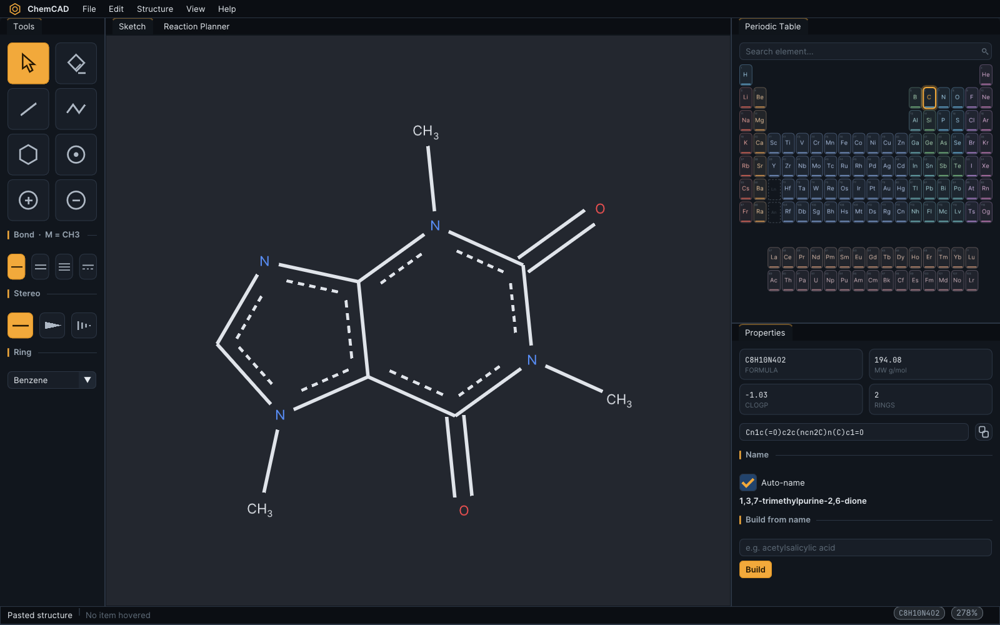
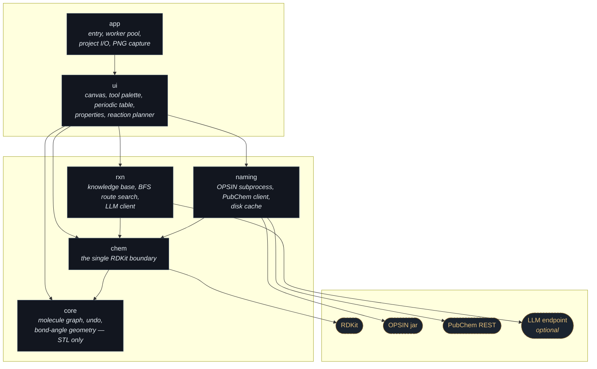
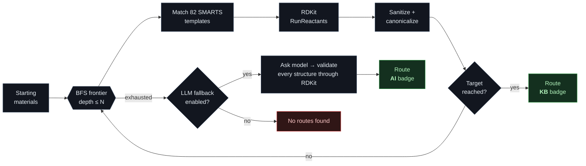
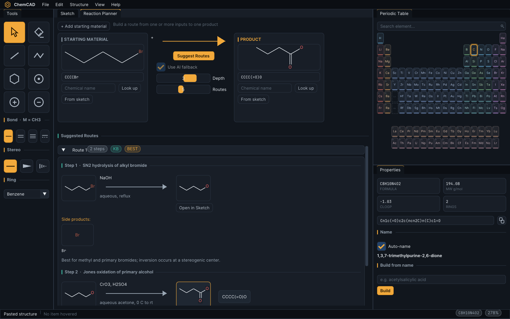
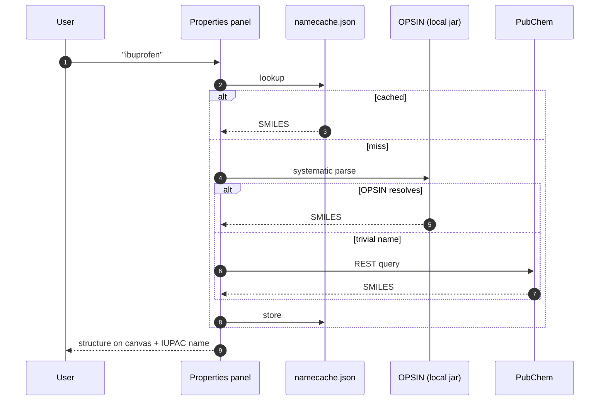
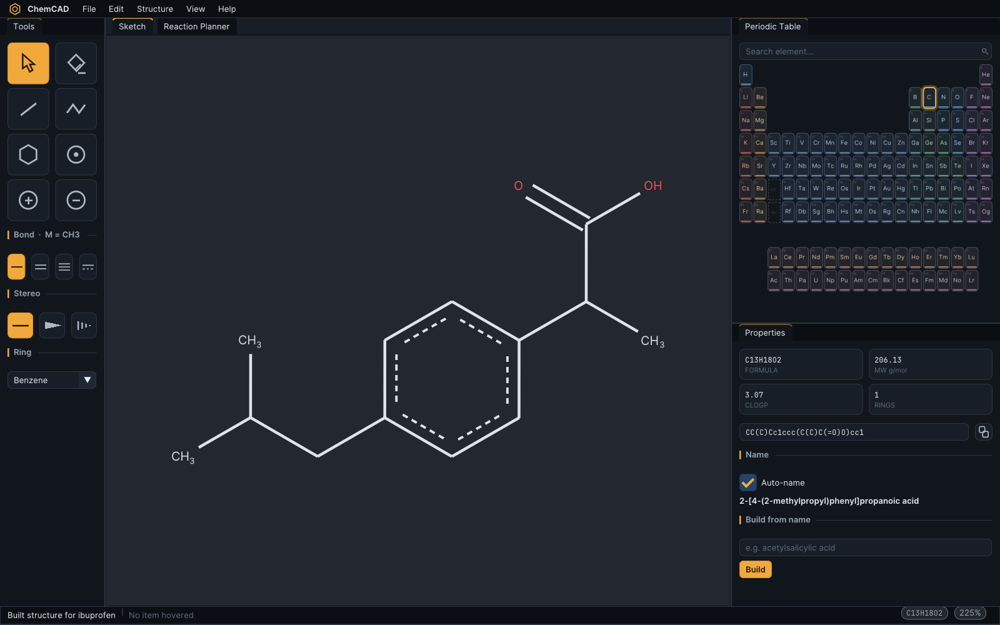
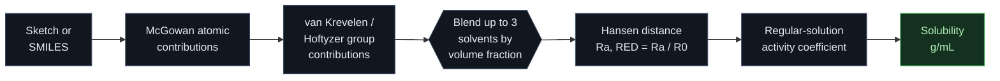
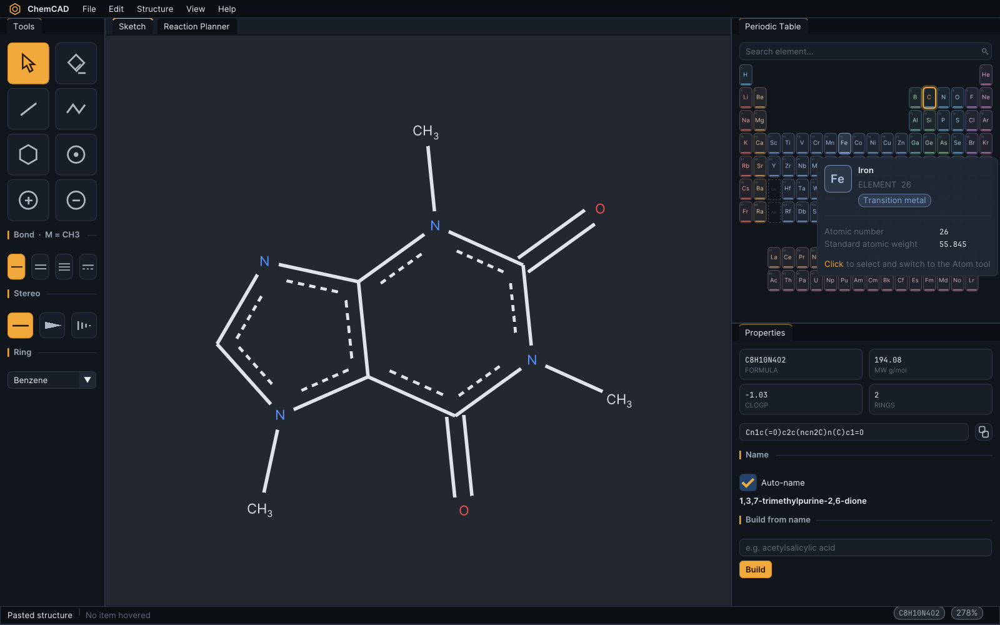

<div align="center">

# ChemCAD

**A ChemDraw-style structure sketcher, name/structure translator and retrosynthesis planner — in a single native C++20 binary.**

[](CMakeLists.txt)
[](https://github.com/ocornut/imgui)
[](https://www.rdkit.org/)
[](tests)
[](LICENSE)



</div>

---

## What it is

Draw a molecule with automatic bond angles, get its formula, weight, cLogP and
IUPAC name live in the side panel — then hand the planner a starting material
and a target and let it search 82 curated reaction templates for a route,
complete with reagents, conditions and predicted side products.

Roughly 8,000 lines of C++20 across five libraries, 1,600 lines of tests, and
no framework: the UI layer is plain Dear ImGui, so it can be hosted inside
another ImGui application unchanged.

| | |
| --- | --- |
| **Sketching** | Angle-snapped bonds, ring templates, wedge/hash stereo, charges, undo/redo, CoordGen clean-up |
| **Chemistry** | RDKit behind one boundary header — canonical SMILES, descriptors, substructure, reaction application |
| **Naming** | `name → structure` via local OPSIN, PubChem fallback for trivial names; `structure → name` via PubChem; both cached on disk |
| **Planning** | Breadth-first search over 82 SMARTS templates, ranked routes, per-step reagents/conditions/by-products/mechanism notes, optional LLM fallback lane |
| **I/O** | Project files, MOL/SMILES export, PNG framebuffer capture of the canvas |

---

## Architecture

Five static libraries with a strictly one-way dependency graph. `core` is pure
STL — the molecule graph, undo stack and bond-angle geometry have no idea RDKit
exists — and every RDKit call in the program funnels through `chem/bridge.hpp`.



Long-running work (naming lookups, route searches) never touches the render
thread: `app::TaskRunner` owns a worker pool and results are pumped back into
`AppState` once per frame.

---

## Route search

`Suggest Routes` runs a breadth-first search from the starting materials,
applying every template whose SMARTS matches, until it reaches the target or
exhausts the depth budget. Each hop records the reagents, conditions,
by-products the atom mapping cannot express, and a mechanism note.





*`CCCCBr → CCCC(=O)O` in two steps: SN2 hydrolysis (NaOH, aqueous reflux,
bromide by-product) followed by Jones oxidation (CrO₃/H₂SO₄).*

---

## Naming

Two independent directions, both cached in `~/.cache/chemcad/namecache.json`.
Without a network the sketcher is unaffected; naming simply reports it is
offline.





---

## Solubility suite

Predicts solubility, in g/mL, of the sketched (or SMILES-entered) compound
in a pure solvent or a blend of up to three solvents, at a chosen
temperature.



The solute side: molar volume from McGowan atomic contributions, and Hansen
solubility parameters (`deltaD`, `deltaP`, `deltaH`) from van
Krevelen/Hoftyzer group contributions on the sketched structure. A blend's
Hansen parameters and density are volume-fraction weighted means of its
components. Hansen distance `Ra = sqrt(4*dD^2 + dP^2 + dH^2)` and `RED = Ra
/ R0` (R0 is the solute's Hansen sphere radius) measure how well solute and
solvent match. Ideal mole-fraction solubility comes from the melting point
via the Yalkowsky equation with an entropy of fusion fixed at 56.5 J/(mol
K); a regular-solution activity coefficient `ln(gamma) = V_solute * Ra^2 /
(4RT)` then corrects that ideal value for the real solute/solvent
interaction, and the resulting mole fraction is converted to g/mL through
the solute and mixture molar volumes.

Melting point defaults to 25 C (the solute is treated as already liquid at
room temperature) unless overridden; a result with `RED > 1` is flagged as
extrapolated outside the Hansen sphere, since the model's confidence there
is untested.

`data/solvents.json` carries 45 common laboratory solvents, each with
Hansen parameters, density, molar volume, dielectric constant, boiling
point, refractive index and water miscibility:

```json
{
  "id": "water",
  "name": "Water",
  "smiles": "O",
  "family": "water",
  "molar_mass": 18.02,
  "density": 0.997,
  "molar_volume": 18.1,
  "delta_d": 15.5,
  "delta_p": 16.0,
  "delta_h": 42.3,
  "dielectric": 80.1,
  "boiling_point": 100.0,
  "refractive_index": 1.333,
  "water_miscible": true
}
```

Add another solvent by dropping a matching object into the array.

The ratio graph plots the prediction as the blend composition changes: a
line of g/mL against the volume fraction of solvent A for a two-solvent
blend, or a shaded ternary diagram for a three-solvent blend, both with a
hover readout of the exact composition and predicted solubility at the
cursor.

### Separatory funnel

A 2D cross-section simulation of a separatory funnel, decanting flask or
graduated cylinder, for working through a liquid-liquid separation before
doing it on the bench.

Each phase is charged with a volume, density, viscosity, interfacial
tension, emulsion stability and colour, and the vessel stacks phases
dense-first. A shake is described the way a chemist describes it --
duration (s), oscillation frequency (Hz) and stroke amplitude (cm) -- and
everything else is derived: the peak slosh velocity u = 2*pi*f*A, the
specific power input epsilon = u^2 f / 2, and a Hinze Sauter mean droplet
size d32 = 0.725 (sigma/rho_c)^0.6 epsilon^-0.4 capped by the Weber
breakup limit (We_crit = 12). Settled volume disperses progressively over
the shake duration at the column-turnover rate f_t = u / H, so a 5 s shake
visibly emulsifies over 5 s while the vessel itself oscillates on screen;
the derived numbers are displayed live in the panel.

Once dispersed, droplets rise or fall through the continuous phase at
their Stokes terminal velocity, coalescing with each other and rejoining
the bulk layer as they settle. Emulsion stability governs how long the
dispersion survives: near 0 it breaks in seconds, near 1 it persists far
longer.

Volume is conserved exactly at every step, and the simulation is
deterministic for a given seed.

---

## Interface



| Area | What it does |
| --- | --- |
| Tool column (left) | Select, eraser, bond, chain, atom, charge tools, plus bond-order / stereo pickers and a ring drop-down that both picks the template and arms the tool |
| Sketch tab | The drawing canvas |
| Reaction Planner tab | Starting-material boxes → product box, route suggestions |
| Periodic Table (right) | All 118 elements; hover for detail, click to draw with it |
| Properties (right) | Formula, MW, cLogP, rings, canonical SMILES, IUPAC name, name→structure |

The UI uses the bundled Inter and JetBrains Mono fonts (SIL OFL, in
`assets/fonts/`) and scales from font metrics, so any UI scale keeps its
proportions — default 1.25, override with `CHEMCAD_UI_SCALE` (0.5–3.0):

```bash
CHEMCAD_UI_SCALE=1.5 ./build/chemcad
```

### Sketching

Bond tool: click empty canvas for a new fragment, click an atom to sprout the
next bond at the correct angle, drag for a snapped bond, and drag onto an
existing atom to close a ring. Click a bond to cycle single → double → triple.

| Keys | Action |
| --- | --- |
| `C N O S P F B I` | Retype the hovered atom (`L` = Cl, `R` = Br) |
| `1` `2` `3` | Set the hovered bond order |
| `W` / `Shift+W` | Wedge / hash stereo |
| `M` | Restore the methyl-ready single-bond preset |
| `Del` / `Esc` | Delete the selection / return to Select |
| `Ctrl+Z` / `Ctrl+Shift+Z` | Undo / redo |
| `Ctrl+C` / `Ctrl+V` | Copy / paste SMILES |
| `Ctrl+F` / `Ctrl+0` | Fit to window / reset zoom |
| Wheel, middle-drag, `Space`+drag | Zoom, pan |

**Structure → Clean Up Structure** relays the whole sketch with CoordGen.

### Drawing methyl groups

ChemCAD draws proper skeletal notation: an unlabelled line end is a carbon
carrying enough implicit hydrogens to satisfy its valence, so a terminal methyl
is a bare line, never a `CH3` glyph. Only heteroatoms, charged or isotopically
labelled carbons, and lone atoms get a written symbol. With the Bond tool,
click an atom to attach a methyl group or drag to choose its direction.

---

## Build

### Debian / Ubuntu

RDKit is packaged, so this is the fast path — no source build.

```bash
sudo apt install -y build-essential cmake ninja-build git pkg-config \
     librdkit-dev rdkit-data libmaeparser-dev libcoordgen-dev \
     libboost-dev libcairo2-dev libcurl4-openssl-dev \
     libgl-dev libglx-dev libopengl-dev \
     libxrandr-dev libxinerama-dev libxcursor-dev libxi-dev \
     libxkbcommon-dev libwayland-dev wayland-protocols extra-cmake-modules \
     default-jre-headless

CHEMCAD_SKIP_RDKIT=1 ./scripts/setup_deps.sh   # just fetches the OPSIN jar
cmake -S . -B build -G Ninja -DCMAKE_BUILD_TYPE=Release
cmake --build build -j"$(nproc)"
./build/chemcad
```

### Fedora

RDKit is not packaged, so it is built once into a user-local prefix.

```bash
sudo dnf install -y boost-devel eigen3-devel freetype-devel libcurl-devel \
                    cmake ninja-build gcc-c++ java-latest-openjdk-headless
./scripts/setup_deps.sh          # builds RDKit + downloads the OPSIN jar (~20 min, cached)
cmake -S . -B build -G Ninja -DCMAKE_BUILD_TYPE=Release
cmake --build build -j"$(nproc)"
./build/chemcad
```

`scripts/setup_deps.sh` is idempotent: it installs RDKit to
`~/.local/share/chemcad-deps/rdkit` and OPSIN to
`~/.local/share/chemcad-deps/share/opsin/opsin.jar`, and skips work already
done. Override the location with `CHEMCAD_DEPS_PREFIX`. GLFW, Dear ImGui,
nlohmann/json and doctest are fetched at configure time.

Without the OPSIN jar the build still succeeds; `name → structure` just falls
back to PubChem for every lookup.

### Windows

Prerequisites: Visual Studio 2022 Build Tools with the C++ workload, CMake
>= 3.24, Ninja and Git. (Verified with MSVC 14.44, CMake 3.30.5.)

```powershell
powershell -ExecutionPolicy Bypass -File scripts\setup_deps.ps1
```

Then, from an `x64 Native Tools Command Prompt for VS 2022`:

```bat
cmake -S . -B build -G Ninja -DCMAKE_BUILD_TYPE=Release -DCMAKE_PREFIX_PATH="%LOCALAPPDATA%\chemcad-deps\rdkit\Library"
cmake --build build
build\chemcad.exe
```

`scripts\win_build.bat` is a one-shot convenience wrapper that runs both of
those steps.

Windows has no RPATH, so a binary can't be told at link time where to find
its shared libraries at runtime. `cmake/StageRuntimeDlls.cmake` works around
that by staging the transitive RDKit/Boost/cairo DLL closure next to each
built executable, so `build\chemcad.exe` runs standalone without the
dependency prefix on `PATH`.

The `Tests` section's `ctest --test-dir build --output-on-failure` works
identically on Windows.

---

## Tests

```bash
ctest --test-dir build --output-on-failure
```

65 cases across 9 suites, all hermetic — no network required.
`test_ui_interaction` drives the real canvas and panel code through a null
ImGui backend, so sketching gestures, hover tooltips and panel widgets are
verified without a display. `test_kb` validates every reaction template against
RDKit, so a malformed SMARTS fails the test run rather than silently never
matching. `test_sol` covers the solubility model (Hansen distance, ideal
solubility, blending) and the funnel simulation's volume-conservation and
determinism invariants.

---

## Reaction planner

Fill one or more starting-material boxes and the product box (by SMILES, by
name lookup, or from the current sketch), then **Suggest Routes**.

Routes found from the knowledge base are badged `KB`. Setting an API key
enables an `AI` fallback lane for targets the templates cannot reach:

```bash
export CHEMCAD_LLM_API_KEY=sk-...
export CHEMCAD_LLM_BASE_URL=https://api.openai.com   # optional
export CHEMCAD_LLM_MODEL=gpt-4o-mini                 # optional
```

Every LLM-proposed structure is validated through RDKit before it is shown, and
any LLM failure silently degrades to knowledge-base-only results.

### Adding reactions

Drop another object into any `data/reactions/*.json` array:

```json
{
  "id": "fischer_esterification",
  "name": "Fischer esterification",
  "smarts": "[C:1](=[O:2])[OX2H1].[OX2H1:3][C:4]>>[C:1](=[O:2])[O:3][C:4]",
  "arity": 2,
  "reagents": ["H2SO4 (cat.)"],
  "conditions": "reflux",
  "byproducts": ["O"],
  "priority": 5,
  "notes": "Equilibrium; driven by excess alcohol or removal of water.",
  "tags": ["esterification", "carbonyl"]
}
```

`byproducts` are the co-products the atom mapping cannot express — this is what
the planner surfaces as side products.

---

## Layout

```
src/core/     molecule graph, undo, bond-angle geometry (STL only)
src/chem/     the single RDKit boundary
src/naming/   OPSIN subprocess + PubChem client + cache
src/rxn/      reaction knowledge base, route search, LLM client
src/ui/       ImGui panels: canvas, periodic table, properties, planner
src/app/      entry point, worker pool, project files, PNG capture
data/         periodic table (118 elements) + 82 reaction templates
tests/        9 doctest suites, including a headless UI interaction suite
```

---

## Author

**Charles Edmonds** — [@CharlesEdmonds](https://github.com/CharlesEdmonds)

Designed and written by me: the molecule graph and geometry, the RDKit
boundary, the naming pipeline, the retrosynthesis search, and the entire ImGui
interface.

## License

[MIT](LICENSE) © 2026 Charles Edmonds.

Bundled Inter and JetBrains Mono fonts are used under the SIL Open Font
License. RDKit (BSD-3-Clause), Dear ImGui (MIT), GLFW (zlib/libpng),
nlohmann/json (MIT), doctest (MIT) and OPSIN (MIT) remain under their own
licenses.
